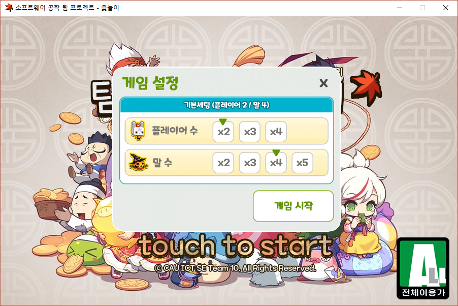

## About The Project
</img>
</img>
</img>
</img>

## License
Distributed under the ICT Team 10. LICENSE for more information.

## Contact
* 박문일 (MoonilPark)
* 박민수 (MinsuPark)
* 전지훈 (JihunJeon)
* 정창민 (ChangMinJeong)

## Acknowledgements
* <a href="https://www.pygame.org/docs/">PYGAME Documnet (Official Web)</a>
* <a href="https://stackoverflow.com/questions/7249388/python-duck-typing-for-mvc-event-handling-in-pygame">Game MVC example (stackoverflow)</a>